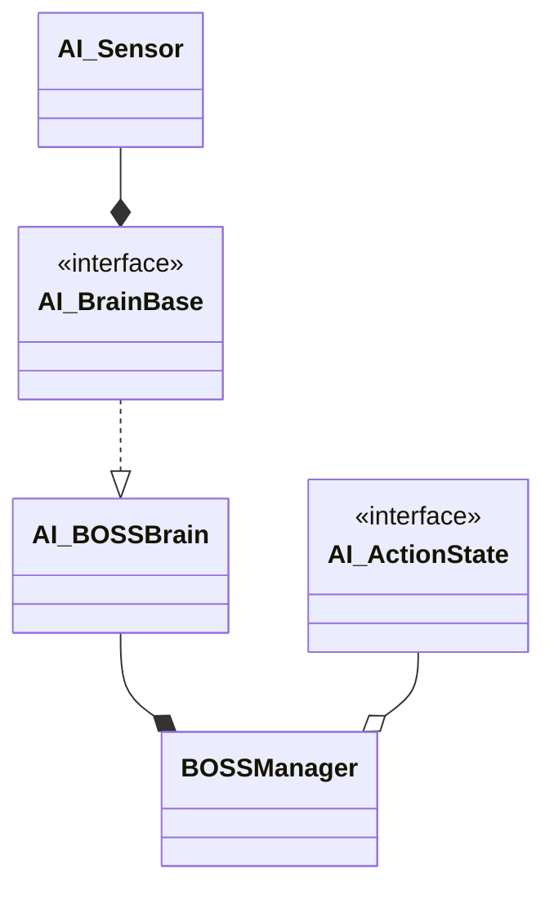
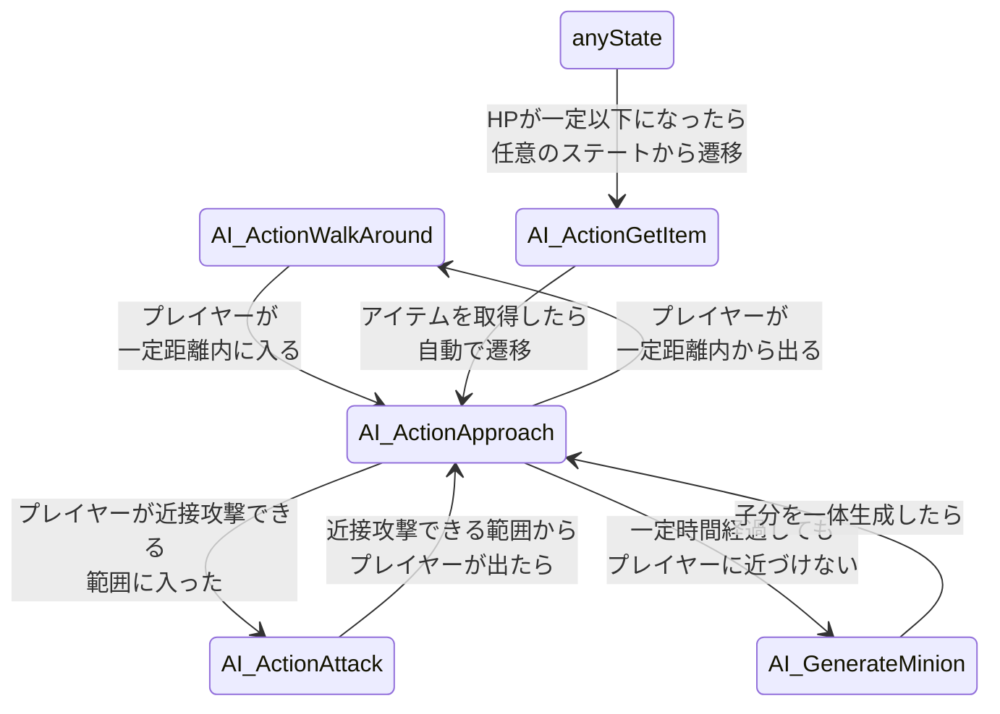

# ボス敵AI設計

ゲームデモ内で最後に出現するボス敵は、ステートマシンのルールベースで意思決定を行うゲームAI(AI_BOSSBrainクラス)を搭載しています。具体的には、ボス敵クラスBOSSManagerのメンバとしてAI_BOSSBrainを持っています。  

ここでは主にこの意思決定における設計を説明します。

## 意思決定の流れ

ボス敵AIは、プレイヤーがいる位置と自身のHPを確認して意思決定を行います。  

具体的な意思決定の振る舞いは、下記のような流れで行います。

1. AI_BOSSBrainクラスの基底クラスのAI_BrainBaseクラスがメンバとして持つ、AI_Sensorクラスを使ってプレイヤーの位置とHPを確認
2. 1でAI_Sensorクラスで調べた情報を基に、AI_ActionStateクラスを継承した適切なクラスを現状のステートとして割り当てます。例えば、プレイヤーが近くにいるものの、近接攻撃ができない場合はAI_ActionApproachクラスを割り当てます。  

上記の流れをおおよそ1フレームに1回行います。各ステートに関しては後述します。  
(UnityのMonobehaviorクラスのUpdate関数で上記の意思決定を行っています)  

## ステートマシン

クラス図の説明の際に示した通り、ボス敵のクラス(BOSS_Manager)は下記のAI_ActionStateクラス  
を継承したクラスの中から適切なステートのクラスを選択することで、意思決定を行います。

AI_ActionStateクラスを継承したクラスと、そのクラスの意思決定内容を下記に示します。

| クラス名 | 対応する意思決定 |
| --- | --- |
| AI_ActionApproach | プレイヤーを追いかける |
| AI_ActionAttack | 近接攻撃をする |
| AI_GenerateMinion | 子分である敵を生成する |
| AI_ActionGetItem | 回復アイテムを探す |
| AI_ActionWalkAround | 一定範囲内を歩き回る |

また、上記のステートの遷移図を下記に示します。  

上記の通り、AI_ActionGetItemのみどのステートからも遷移でき、  
他のステートに関してはプレイヤーとの距離によってステートを変更します。  
プレイヤーが隣接していれば近接攻撃を行い、近接攻撃ができない距離を保たれていて一定時間経過すると、子分を生成します。
