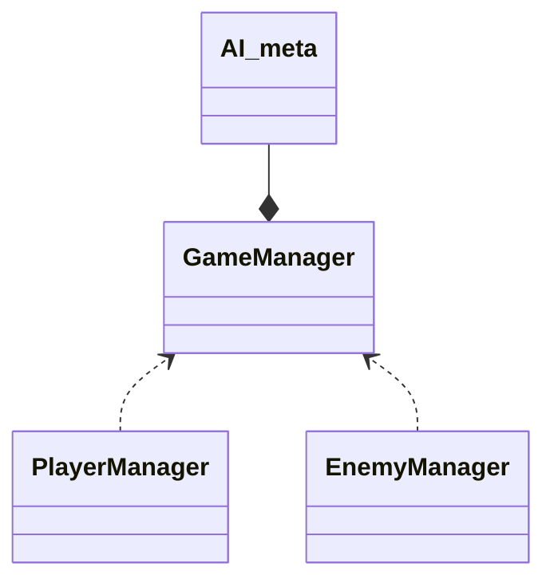
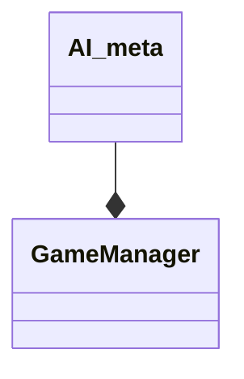
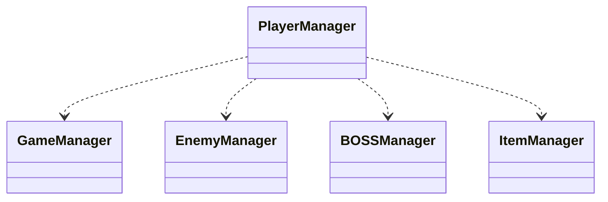
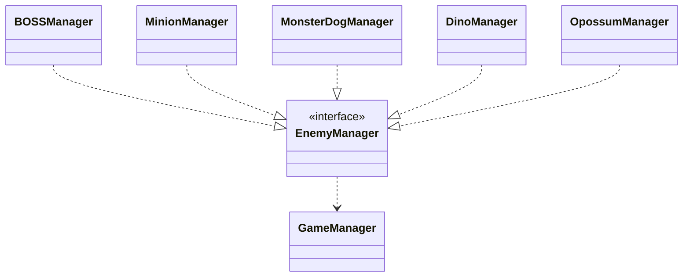
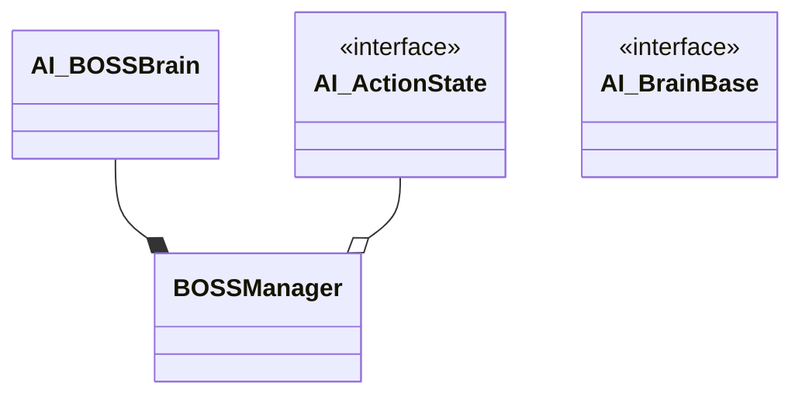
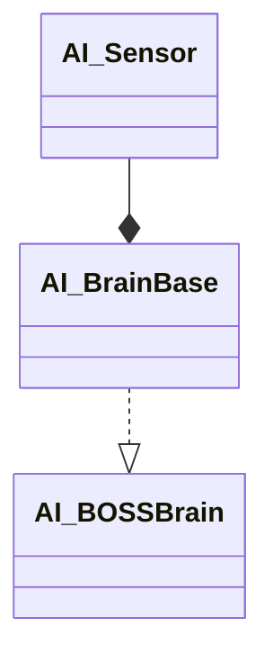
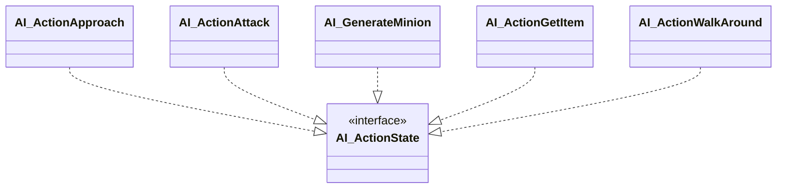
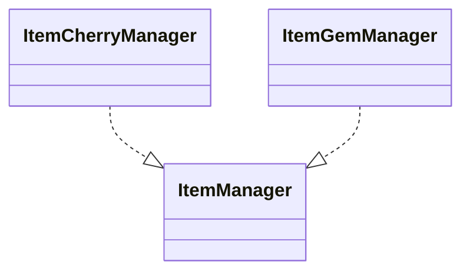

# クラス設計

ここでは、使用しているスクリプトで定義したクラス同士の関連性について説明します。  

## GameManager(ゲーム全体管理スクリプト)

GameClear判定とGameOver判定と、敵・アイテムの再生成を行います。  

GameClear判定とGameOver判定に関しては、プレイヤー制御用のスクリプト(PlayerManager)と敵制御用のスクリプト(EnemyManager)から通知します。  
敵とアイテムの再生成はメンバであるAI_metaクラスで行います。  

## AI_meta(メタAI制御用スクリプト)

ゲーム全体を監視しながらアイテムと敵の総数を管理するクラスです。  
下記のようにゲームデモ内にオブジェクトGameManagerが存在し、メタAIであるAI_metaクラスを持っています。

メタAIとゲーム全体に関しての説明は[こちら](/doc/class.md)を参照してください。

## PlayerManager(プレイヤー制御用スクリプト)

プレイヤーの動きの制御と、オブジェクトと接触した際の制御を行います。

敵に上空から接触した場合は敵を破壊するか、ダメージを与える処理をします。  
棘オブジェクトに接触したり、ステージから落下した場合にはGameManagerを参照し、ゲームオーバーの処理を行います。

## EnemyManager(敵制御用インターフェイス)

ゲームデモ内に存在する敵を制御するインターフェイスクラスです。全てEnemyManagerを継承しています。  
他のクラスからはEnemyManagerを参照するようにしています。

上記に示したクラスMinionManager, DinoManager, MonsterDogManager, OpossumManager, BOSSManagerが敵を制御するスクリプトです。  
また、後述するメタAIでゲームデモ内にいる敵の数を管理するため、プレイヤーに倒された際にGameManagerへ通知します。

## DinoManager

- 足の短い悪魔の敵を制御します。制御としては真っすぐ進むだけです。

## MonsterDogManager

- 頭が全て口になっている犬の敵を制御します。プレイヤーキャラクターを追尾します。

## OpossumManager

- ネズミの敵です。ゲームでオン内のフィールドから落ちないように動きます。

## BOSSManager

マッシュルームのような形をした敵(ボス敵)を制御します。

ボス敵は、ステートマシンを使用した意思決定を行います。  
BOSSManagerは現在のステートを示すAI_ActionStateクラスと、意思決定を行うAI_BOSSBrainクラスをメンバに持ちます。  
ステートマシン制御に関しては、[こちら](/doc/bossAI.md)で説明しています。  

## AI_BOSSBrain(AI_BrainBase)

ボスのステート制御に関して管理するクラスです。  
AI_BOSSBrainクラスはAI_BrainBaseクラスを継承しており、AI_BrainBaseクラスはボス敵の周辺の  
オブジェクトを認識するAI_Sensorクラスをメンバに持ちます。   

## AI_Sensor

AI_BrainBaseクラスがメンバにもつ、ボス敵の周辺のオブジェクトを認識するクラスです。  
このクラスが計算した結果を基に、AI_BrainBaseクラスを継承したクラスが意思決定を行います。  

## AI_ActionState

BOSSManagerがメンバに持つAI_ActionStateクラス
AI_ActionStateクラスを継承したクラスが下記のクラスです。  
この五つのクラスが意思決定のパターンになります。つまり、  
ボス敵には五つの行動パターンがあり、それをAI_Sensorクラスで認識した情報を参考に行動パターン  
を切り替えます。  

## ItemManager(アイテムクラスインターフェイス)

各アイテムオブジェクトに対応するクラスはItemManagerクラスを継承し、他のクラスからはItemManagerを参照するようにしています。  
プレイヤーや敵オブジェクトが接触時にクラス内で設定されたパラメータを参照します。

ItemCherryManagerとItemGemManagerは、コンストラクタで設定しているアイテムを取得した際のHPの回復量が違うだけなので説明は割愛します。

