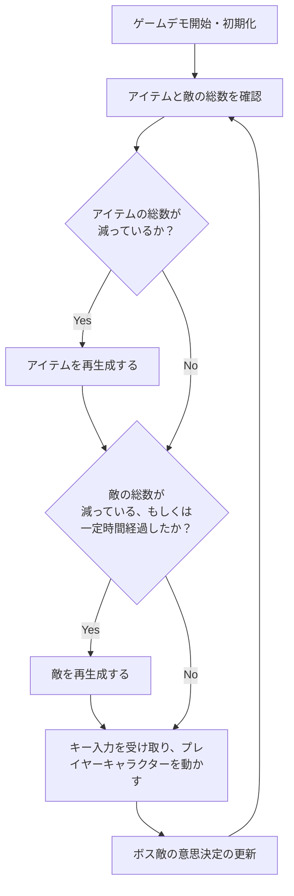

# ゲームループ設計

ここでは、ゲームデモ内で1フレームごとに行う処理について説明します。  

ゲームデモ内では、主に下記を1フレームに一回行います。  

- ゲームデモ内の敵の数が一定以上になるように管理
- ゲームデモ内のアイテムの数が一定数になるように管理
- ボス敵の意思決定の更新

ゲームデモ内での1フレーム内での処理のフローを下記に示します。  
(アイテムの取得、敵の撃破処理はプレイヤークラス(PlayerManager)のイベント処理として行っています)  
  

ゲームデモ内の敵の数とアイテムの数は、ゲーム全体を管理するGameManagerクラスがメンバとして持つ、AI_metaクラスで行います。  
また、ボス敵の意思決定は[こちら](/doc/bossAI.md)で説明しています。  
  
## メタAIクラス

メタAIクラスは、ゲームループの中で下記の機能を持っています。  

- アイテムの総数が一定になるように管理
- 一定時間経過するまでは敵の数も一定になるように管理
- 一定時間経過した場合は敵が増え続ける
    
具体的には、unityのMonobehaviorクラスのUpdate関数でアイテムと敵が減ったかを確認し、減った分だけ敵もしくはアイテムを再生成します。  

クラスに関しては[こちら](/doc/class.md)で説明しています。  

